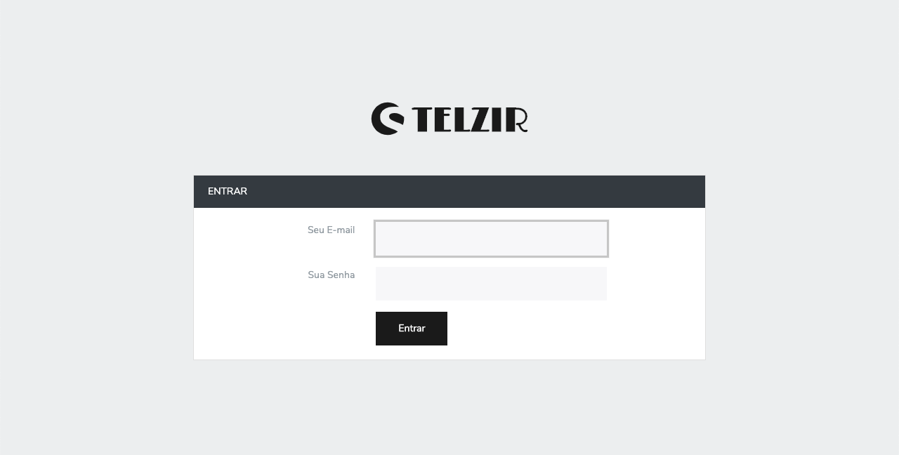
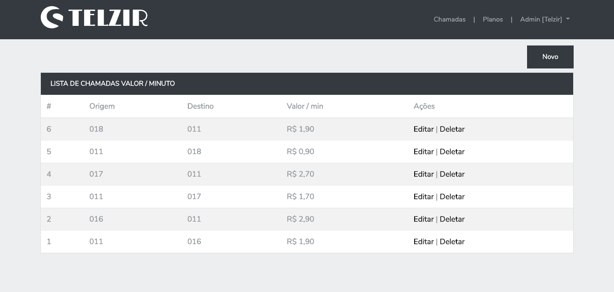
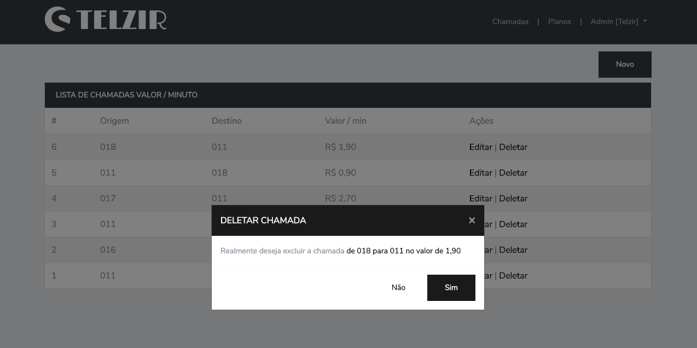
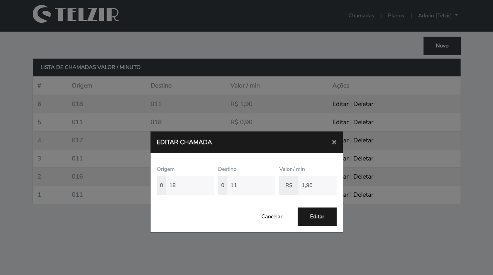

<!-- Info Header -->
<table>
  <tr>
    <td>
      
    </td>
    <td>
      <h3>
        Teste aplicado para uma empresa
      </h3>
      
Pequeno projeto que serviu de teste para uma empresa, desenvolvido em laravel modularizado.

      

        
        
      

      <p">
        <a href="#telas-do-sistema">Telas do Sistema</a>&nbsp;&nbsp;&nbsp;|&nbsp;&nbsp;&nbsp;
        <a href="#descrição">Descrição</a>
      

    </td>
  </tr>
</table>

#### Telas do Sistema

    

    

    

    

    

---

#### Descrição

Pequeno projeto desenvolvido para um teste de uma empresa, foi aplicado uma estrutura modular, presenters, migrations e seeds.

Sistema onde é possível cadastrar chamadas e planos, e o frontend tem uma calculadora para mostrar as vantagens de usar ou não o plano da empresa.

**Obs.:** Use o `php artisan db:seed` para poder popular o sistema e criar o usuário de acesso.
